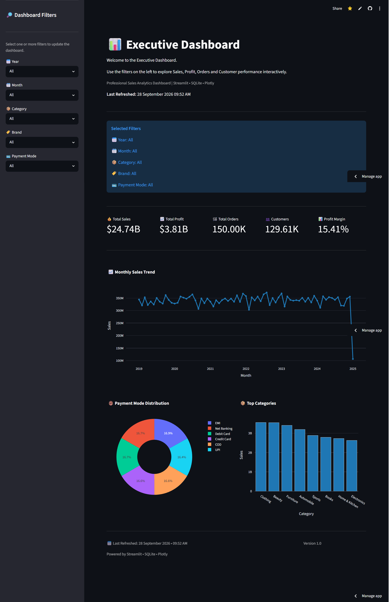
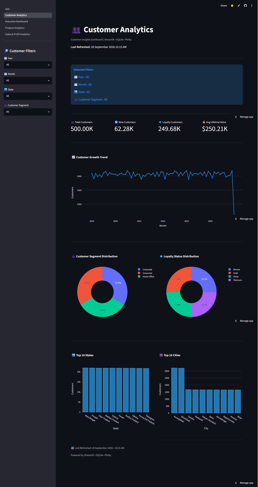
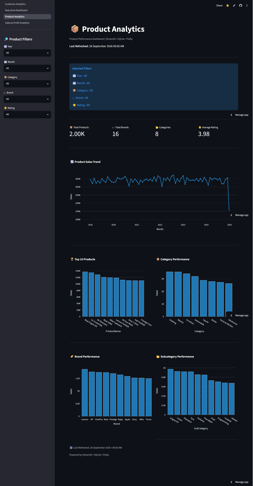
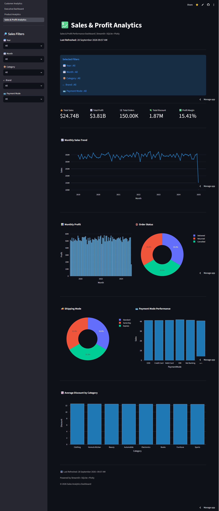

<div align="center">

# 📊 Sales Analytics Platform

The application is deployed using Streamlit Community Cloud and provides access to all four interactive analytics dashboards.

## 🔗 Project Links

- 🚀 [Live Streamlit Dashboard](https://sales-analytics-platform.streamlit.app/)
- 💻 [GitHub Repository](https://github.com/Praveen8279/sales-analytics-platform)

### 🚀 End-to-End Business Intelligence & Data Analytics Solution

Transforming raw sales data into meaningful business insights using **Python, SQL, SQLite, Streamlit, Plotly, and Power BI**.

<br>


<br>


</div>

---

# 📖 Table of Contents

- Project Overview
- Business Problem
- Project Objectives
- Key Features
- Technology Stack
- System Architecture
- Project Workflow
- Folder Structure
- Database Schema
- Dashboard Pages
- Power BI Dashboard
- SQL Techniques
- Installation Guide
- Configuration
- Running the Project
- KPI Documentation
- Business Insights
- Performance Optimization
- Skills Demonstrated
- Resume Description
- Interview Questions
- Future Enhancements
- Project Statistics
- License
- Author

---

# 🚀 Project Overview

The **Sales Analytics Platform** is a complete **Business Intelligence** solution that converts raw transactional sales data into meaningful business insights using modern analytics tools.

This project demonstrates the complete analytics lifecycle:

- Data Storage
- SQL Querying
- Data Processing
- Interactive Visualization
- Executive Reporting
- Business Decision Support

The project combines the power of:

- Python
- SQLite
- SQL
- Pandas
- Streamlit
- Plotly
- Power BI

to create a professional analytics platform suitable for portfolio projects and business reporting.

---

# 💼 Business Problem

Businesses generate thousands of sales transactions every day.

Although valuable information exists within these transactions, it is difficult to answer questions such as:

- Which products generate the highest sales?
- Which categories are most profitable?
- How do sales change over time?
- Which payment methods are preferred?
- Which customers contribute the highest value?
- Which products require attention?

Without an analytics platform, answering these questions requires manual reporting that is time-consuming and prone to errors.

---

# 🎯 Project Objectives

The primary objective of this project is to develop a modern Business Intelligence platform capable of transforming raw sales data into interactive dashboards.

The project focuses on:

- Sales Analysis
- Profit Analysis
- Customer Analysis
- Product Analysis
- Business KPIs
- Interactive Reporting
- Executive Decision Support

---

# ⭐ Key Features

### 📊 Executive Dashboard

- Total Sales
- Total Profit
- Total Orders
- Total Customers
- Monthly Sales Trend
- Payment Mode Distribution
- Top Categories

---

### 👥 Customer Analytics

- Customer KPIs
- Customer Growth
- Customer Segmentation
- Loyalty Status
- Top Cities
- Top States

---

### 📦 Product Analytics

- Product KPIs
- Product Performance
- Brand Performance
- Category Analysis
- Subcategory Analysis
- Product Ratings

---

### 💹 Sales & Profit Analytics

- Sales Trend
- Profit Trend
- Profit Margin
- Discount Analysis
- Shipping Analysis
- Payment Analysis
- Order Status

---

### 📈 Power BI Dashboard

Professional Business Intelligence dashboard including

- KPI Cards
- Interactive Charts
- Slicers
- Filters
- Business Insights

---

# 🛠 Technology Stack

| Category | Technologies |
|----------|--------------|
| Programming | Python 3.13 |
| Database | SQLite |
| Query Language | SQL |
| Data Processing | Pandas |
| Dashboard | Streamlit |
| Visualization | Plotly |
| Business Intelligence | Power BI |
| Version Control | Git |
| Repository | GitHub |
| IDE | Visual Studio Code |

---

# 🏗 System Architecture

```text
                    Raw Dataset
                         │
                         ▼
                 Data Cleaning
                         │
                         ▼
                 SQLite Database
                         │
                         ▼
                  Optimized SQL
                         │
          ┌──────────────┴──────────────┐
          │                             │
          ▼                             ▼
 Streamlit Dashboard            Power BI Dashboard
          │                             │
          └──────────────┬──────────────┘
                         ▼
              Business Insights
                         │
                         ▼
              Business Decision Making
```

---

# 📂 Project Structure

```text
sales-analytics-platform/

│

├── data/
│   ├── raw/
│   ├── processed/
│   └── database/
│
├── powerbi/
│
├── reports/
│
├── screenshots/
│
├── sql/
│
├── src/
│
├── streamlit_app/
│   ├── app.py
│   ├── assets/
│   ├── pages/
│   └── utils/
│
├── README.md
├── requirements.txt
├── LICENSE
└── .gitignore
```

---

# 🗄 Database Schema

The project uses a relational **SQLite Database** consisting of four interconnected tables.

---

## 📦 Sales Table

The **Sales** table stores all transactional records.

| Column | Description |
|---------|-------------|
| OrderID | Unique Order Identifier |
| CustomerID | Customer Reference |
| EmployeeID | Employee Reference |
| ProductID | Product Reference |
| OrderDate | Order Date |
| DeliveryDate | Delivery Date |
| Quantity | Quantity Sold |
| CostPrice | Product Cost Price |
| SellingPrice | Product Selling Price |
| Discount | Discount Applied |
| SalesAmount | Total Sales Value |
| Profit | Profit Earned |
| ShippingCost | Shipping Cost |
| PaymentMode | Payment Method |
| ShippingMode | Shipping Method |
| OrderStatus | Current Order Status |

---

## 👥 Customers Table

Stores customer information.

| Column | Description |
|---------|-------------|
| CustomerID | Unique Customer ID |
| CustomerName | Customer Name |
| Gender | Gender |
| Age | Customer Age |
| Email | Email Address |
| Phone | Contact Number |
| City | City |
| State | State |
| CustomerSegment | Customer Category |
| JoinDate | Registration Date |
| LoyaltyStatus | Loyalty Level |
| LifetimeValue | Customer Lifetime Value |

---

## 📦 Products Table

Stores product information.

| Column | Description |
|---------|-------------|
| ProductID | Product ID |
| ProductName | Product Name |
| Category | Product Category |
| SubCategory | Product Sub Category |
| Brand | Brand Name |
| Supplier | Supplier Name |
| CostPrice | Cost Price |
| SellingPrice | Selling Price |
| Stock | Available Stock |
| Rating | Product Rating |

---

## 👨‍💼 Employees Table

Stores employee information.

| Column | Description |
|---------|-------------|
| EmployeeID | Employee ID |
| EmployeeName | Employee Name |
| Gender | Gender |
| Department | Department |
| Designation | Job Role |
| Manager | Reporting Manager |
| Region | Working Region |
| State | Working State |
| Salary | Employee Salary |
| JoiningDate | Joining Date |
| PerformanceRating | Performance Rating |

---

# 📸 Dashboard Screenshots

## 📊 Executive Dashboard

The Executive Dashboard provides a high-level overview of business performance through key sales and profit KPIs, monthly trends, payment mode distribution, and category analysis.



---

## 👥 Customer Analytics

The Customer Analytics dashboard focuses on customer behavior, customer segments, customer distribution, and customer-related sales insights.



---

## 📦 Product Analytics

The Product Analytics dashboard provides product, category, and sub-category level analysis to understand product performance.



---

## 💰 Sales & Profit Analytics

The Sales & Profit Analytics dashboard provides detailed analysis of sales performance, profitability, trends, and financial KPIs.



---


# 📈 Power BI Dashboard

A professional Business Intelligence dashboard was also developed using Microsoft Power BI.

---

## Features

✔ Interactive Slicers

✔ KPI Cards

✔ Dynamic Charts

✔ Drill-down Reports

✔ Business Filters

✔ Executive Summary

---


# 🛢 SQL Techniques Used

This project demonstrates practical SQL skills commonly used in Business Intelligence and Data Analytics.

---

## Aggregate Functions

Used to summarize business data.

```sql
SUM()
COUNT()
AVG()
MAX()
MIN()
```

Applications:

- Total Sales
- Total Profit
- Average Order Value
- Customer Count
- Product Count

---

## GROUP BY

Used for business aggregation.

Example:

```sql
SELECT
Category,
SUM(SalesAmount)
FROM Sales
GROUP BY Category;
```

Used in

- Category Analysis
- Brand Analysis
- Payment Analysis
- Shipping Analysis

---

## ORDER BY

Used to rank business performance.

Example

```sql
ORDER BY Sales DESC
```

Applications

- Top Products
- Top Categories
- Highest Sales
- Best Customers

---

## JOIN Operations

The project combines multiple business tables.

```sql
INNER JOIN
LEFT JOIN
```

Used between

Sales ↔ Customers

Sales ↔ Products

Sales ↔ Employees

---

## Date Functions

Used for time-based analysis.

```sql
strftime('%Y',OrderDate)

strftime('%m',OrderDate)

strftime('%Y-%m',OrderDate)
```

Applications

- Yearly Reports

- Monthly Reports

- Quarterly Reports

---

## Filtering

Dynamic SQL filtering powers the Streamlit dashboard.

Examples

```sql
WHERE Year=2025

WHERE PaymentMode='UPI'

WHERE Category='Electronics'
```

---

## LIMIT

Used for Top N analysis.

```sql
LIMIT 10
```

Applications

- Top Products

- Top Categories

- Top Cities

---

# 📊 KPI Documentation

The dashboard calculates several Key Performance Indicators (KPIs).

---

## 💰 Total Sales

Formula

```text
SUM(SalesAmount)
```

Business Purpose

Measures total revenue generated.

---

## 📈 Total Profit

Formula

```text
SUM(Profit)
```

Business Purpose

Measures total earnings after deducting costs.

---

## 🛒 Total Orders

Formula

```text
COUNT(OrderID)
```

Business Purpose

Measures overall sales activity.

---

## 👥 Total Customers

Formula

```text
COUNT(DISTINCT CustomerID)
```

Business Purpose

Measures customer reach.

---

## 📦 Average Order Value

Formula

```text
Total Sales / Total Orders
```

Business Purpose

Measures customer spending behavior.

---

## 📉 Profit Margin

Formula

```text
Profit / Sales × 100
```

Business Purpose

Measures business profitability.

---

# ⚡ Performance Optimization

Several optimization techniques were implemented to improve dashboard speed.

---

## Streamlit Caching

```python
@st.cache_data
```

Benefits

✔ Faster Loading

✔ Reduced Database Calls

✔ Better User Experience

---

## SQL-Level Filtering

Instead of loading all records into Pandas, filters are applied directly within SQL.

Benefits

✔ Lower Memory Usage

✔ Faster Execution

✔ Better Scalability

---

## Modular Code Structure

Reusable utility modules

database.py

charts.py

helpers.py

Advantages

- Easy Maintenance

- Cleaner Code

- Reusability

---

## Optimized Queries

Only required columns are selected.

Instead of

```sql
SELECT *
```

The project uses

```sql
SELECT SalesAmount, Profit
```

This improves execution speed.

---

## Reusable Plotly Components

Chart creation is centralized.

Benefits

✔ Consistent Design

✔ Less Code

✔ Easier Updates

---

# 📥 Installation Guide

## Clone Repository

```bash
git clone https://github.com/Praveen8279/sales-analytics-platform.git
```

---

## Navigate

```bash
cd sales-analytics-platform
```

---

## Create Virtual Environment

Windows

```bash
python -m venv .venv
```

Activate

```bash
.venv\Scripts\activate
```

Linux / macOS

```bash
python3 -m venv .venv

source .venv/bin/activate
```

---

## Install Dependencies

```bash
pip install -r requirements.txt
```

---

# ⚙ Configuration

Database location

```text
data/database/sales.db
```

Database connection

```text
streamlit_app/utils/database.py
```

The dashboard automatically connects to the SQLite database.

---

# ▶ Running the Project

Launch Streamlit

```bash
streamlit run streamlit_app/app.py
```

Default URL

```text
http://localhost:8501
```

---

# 📈 Business Insights

The dashboards help answer important business questions.

---

## 📊 Sales Insights

- Track monthly sales performance.
- Compare sales across different periods.
- Identify seasonal sales trends.
- Measure revenue growth.

---

## 💰 Profit Insights

- Monitor monthly profit.
- Compare profit with sales.
- Measure profit margin.
- Evaluate the impact of discounts.

---

## 👥 Customer Insights

- Analyze customer growth.
- Understand customer segmentation.
- Monitor customer loyalty.
- Identify high-value customers.

---

## 📦 Product Insights

- Identify top-performing categories.
- Compare brand performance.
- Monitor product ratings.
- Analyze product demand.

---

## 💳 Payment Insights

- Compare payment methods.
- Identify customer payment preferences.
- Measure digital payment adoption.

---

## 🚚 Shipping Insights

- Compare shipping modes.
- Monitor order completion.
- Analyze order status.

---

# 🧠 Skills Demonstrated

## Technical Skills

- Python
- SQL
- SQLite
- Pandas
- Streamlit
- Plotly
- Power BI
- Git
- GitHub

---

## Analytical Skills

- Data Cleaning
- Business Intelligence
- Dashboard Development
- KPI Design
- Business Analysis
- Data Visualization
- Reporting

---

## Software Engineering Skills

- Modular Architecture
- Reusable Components
- Documentation
- Version Control
- Performance Optimization

---

# 📄 Resume Project Description

## Sales Analytics Platform

Developed a complete Sales Analytics Platform using Python, SQL, SQLite, Streamlit, Plotly, and Power BI to transform raw transactional data into interactive business dashboards.

### Responsibilities

- Designed relational SQLite database
- Developed reusable SQL queries
- Built interactive Streamlit dashboards
- Created Plotly visualizations
- Designed Power BI dashboard
- Optimized dashboard performance
- Implemented modular project architecture
- Prepared professional project documentation

### Technologies

Python • SQL • SQLite • Pandas • Streamlit • Plotly • Power BI • Git • GitHub

---

# 🚀 Future Enhancements

Future improvements planned for this project include:

## Analytics

- Sales Forecasting using Machine Learning
- Customer Churn Prediction
- Product Recommendation System
- Inventory Forecasting

---

## Dashboard

- Dark Theme
- Export Dashboard as PDF
- Excel Report Export
- Scheduled Reports

---

## Database

- PostgreSQL Migration
- MySQL Support
- Cloud Database

---

## Deployment

- Docker
- Azure
- AWS
- Render
- Streamlit Community Cloud

---

## Security

- User Authentication
- Role-Based Access Control
- Activity Logging

---

## AI Features

- AI Business Insights
- Natural Language Queries
- Automated Report Generation

---

# ❓ Frequently Asked Interview Questions

The following are common interview questions related to this project.

---

## 1. Explain your project in 2 minutes.

The Sales Analytics Platform is an end-to-end Business Intelligence solution developed using Python, SQL, SQLite, Streamlit, Plotly, and Power BI. It transforms raw sales data into interactive dashboards that help businesses monitor sales, profits, customers, and product performance through KPIs and visual analytics.

---

## 2. Why did you use SQLite?

SQLite is lightweight, serverless, portable, and ideal for analytics applications where a full database server is unnecessary.

---

## 3. Why Streamlit?

Streamlit allows rapid development of interactive web dashboards using only Python without requiring HTML, CSS, or JavaScript.

---

## 4. Why Plotly?

Plotly provides responsive and interactive charts that improve user experience compared to static visualizations.

---

## 5. Why Power BI?

Power BI is an industry-standard Business Intelligence platform used for executive reporting and self-service analytics.

---

## 6. Why SQL instead of filtering in Pandas?

Filtering data at the SQL level reduces memory usage, improves query performance, and minimizes unnecessary data transfer.

---

## 7. Why modular programming?

Modular programming improves code readability, maintainability, reusability, scalability, and testing.

---

## 8. How is dashboard performance optimized?

- Streamlit caching
- Optimized SQL queries
- Reusable chart functions
- SQL-level filtering
- Efficient database access

---

## 9. What are KPIs?

KPIs (Key Performance Indicators) measure business performance.

Examples:

- Total Sales
- Total Profit
- Total Orders
- Total Customers
- Average Order Value
- Profit Margin

---

## 10. What business problem does this project solve?

The project transforms raw sales data into actionable business insights that support strategic decision-making.

---

# 🔒 Repository Management

This repository is maintained exclusively by the repository owner.

### Access Policy

- ✅ Anyone can view this project.
- ✅ Anyone can clone or fork this repository.
- ✅ Anyone can use this project under the MIT License.
- ❌ Direct modifications to the original repository are **not permitted**.
- ❌ External write access is **not granted**.
- ❌ Only the repository owner (Administrator) can approve, modify, or merge changes into the main branch.

This policy ensures the integrity, consistency, and quality of the project.

---

# 📜 License

This project is licensed under the **MIT License**.

- ✅ Anyone may view this repository.
- ✅ Anyone may fork or clone it for learning purposes.
- ✅ Anyone may use the code under the MIT License.
- ❌ Only the repository owner (Administrator) can modify the original repository.
- ❌ External users cannot push changes directly to this repository unless explicitly granted write access.

See the `LICENSE` file for complete details.

MIT License

Copyright (c) 2026 Praveen Singh

Permission is hereby granted, free of charge, to any person obtaining a copy
of this software and associated documentation files (the "Software"), to deal
in the Software without restriction, including without limitation the rights
to use, copy, modify, merge, publish, distribute, sublicense, and/or sell
copies of the Software, and to permit persons to whom the Software is
furnished to do so, subject to the following conditions:

1. The above copyright notice and this permission notice shall be included in
   all copies or substantial portions of the Software.

2. Any modified version of this Software must clearly state that changes have
   been made and must not imply endorsement by the original author.

THE SOFTWARE IS PROVIDED "AS IS", WITHOUT WARRANTY OF ANY KIND, EXPRESS OR
IMPLIED, INCLUDING BUT NOT LIMITED TO THE WARRANTIES OF MERCHANTABILITY,
FITNESS FOR A PARTICULAR PURPOSE, AND NONINFRINGEMENT. IN NO EVENT SHALL THE
AUTHOR OR COPYRIGHT HOLDER BE LIABLE FOR ANY CLAIM, DAMAGES OR OTHER
LIABILITY, WHETHER IN AN ACTION OF CONTRACT, TORT OR OTHERWISE, ARISING FROM,
OUT OF OR IN CONNECTION WITH THE SOFTWARE OR THE USE OR OTHER DEALINGS IN THE
SOFTWARE.

---

# 👨‍💻 Author

## Praveen Singh

**B.Tech – Computer Science Engineering**

### Technical Skills

- Python
- SQL
- SQLite
- Pandas
- Streamlit
- Plotly
- Power BI
- Git
- GitHub
- Data Analytics
- Business Intelligence

---

## Connect With Me

> Replace these with your actual links before publishing.

- GitHub: https://github.com/Praveen8279
- LinkedIn: www.linkedin.com/in/praveensingh82143
- Email: praveenkumar82143@gmail.com

---

# ⭐ Thank You for Visiting ⭐

### If you like this project, please consider giving it a ⭐ on GitHub.

**Built with ❤️ using Python, SQL, SQLite, Streamlit, Plotly, and Power BI**

---

**© 2026 Praveen Singh. All Rights Reserved.**

</div>
